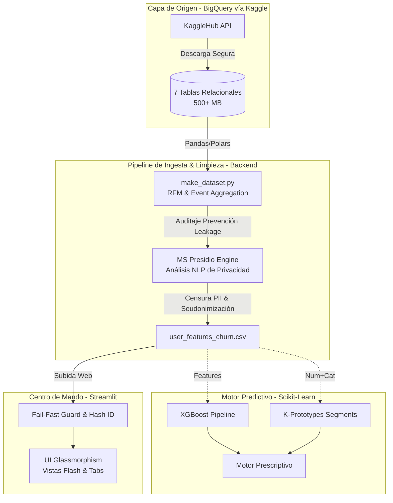

---

## 🏆 Insignias


## 📌 Índice
- [Descripción del Negocio](#-descripción)
- [Documentación Técnica Detallada](#-documentación-técnica-detallada)
- [Roles del Proyecto](#-roles-del-proyecto)
- [Funciones y Aplicaciones](#-funciones-y-aplicaciones)
- [Arquitectura de la Solución](#️-arquitectura-de-la-solución)
- [Estructura del Proyecto](#-estructura-del-proyecto)
- [Privacidad Zero Trust (Shift-Left)](#-privacidad-zero-trust-shift-left)
- [Instalación y Contribución](#-instalación-y-contribución)

---

## 📙 Descripción Integral

**Objetivo del Proyecto:** *"Desarrollar un modelo de análisis y predicción de churn (abandono de clientes) para empresas de e-commerce, que permita identificar patrones de comportamiento, detectar señales tempranas de fuga y generar insights accionables para mejorar la retención."*

A continuación se demuestra arquitectónicamente **cómo** el equipo alcanzó este nivel de desarrollo industrial:

### 🎯 Mapeo de Cumplimiento Quirúrgico (Arquitectura de Código)
La justificación asertiva y el código crudo (.py) implementado por el equipo se encuentra dividido respetando los pilares de este objetivo matriz:

1. [*"...un modelo de análisis y predicción de churn..."*] -> [Ver Documentación: Predicción y Scikit-Learn](docs/1_prediccion_churn.md)
2. [*"...permitiendo identificar patrones de comportamiento..."*] -> [Ver Documentación: Polars y K-Prototypes](docs/2_patrones_comportamentales.md)
3. [*"...detectar señales tempranas de fuga..."*] -> [Ver Documentación: Explicabilidad IA (SHAP) y Data Leakage](docs/3_senales_tempranas_xai.md)
4. [*"...y generar insights accionables para mejorar la retención."*] -> [Ver Documentación: Arquitectura de Predicción (Hubspot/JSON)](docs/4_insights_accionables.md)
5. **[Motor Prescriptivo de Negocios]** -> [Ver Documentación: Lógica Heurística y Reglas de Campaña](docs/6_motor_prescriptivo_negocio.md)
6. **[RAG Rígidio: Hibridación IA]** -> [Ver Documentación: Traducción Ejecutiva con SHAP + Gemini Flash](docs/7_xai_llm_hybrid_pipeline.md)
7. **[Sostenibilidad a Largo Plazo]** -> [Ver Documentación: Arquitectura MLOps Inmortal (Champion vs Challenger)](docs/5_arquitectura_mlops_evolutiva.md)
8. **[Reingeniería de Negocio]** -> [Ver Documentación: Filtrado BOFU en el Funnel de Conversión](docs/8_embudo_bofu_conversion.md)

---

## 📚 Documentación Técnica Detallada
Para una comprensión profunda de las decisiones arquitectónicas, validaciones estadísticas y la mitigación de los riesgos en el entrenamiento (como el uso de *Polars* y la prevención del *Data Leakage*), consulta el manifiesto del proyecto:

- [**📔 Informe Ejecutivo de Hallazgos**](./reports/informe_ejecutivo.md)
- [🚀 Roadmap de Hitos Consolidados](./avance.md)
- [🔮 Planificación Futura](./avance_futuro.md)

---

## 💻 Interfaz de la Plataforma
| Prescripción de Acciones | Benchmark de Modelos y Explicabilidad (SHAP) |
|:---:|:---:|
|  |  |
| **Generación de Embudos (2.4M Eventos)** | **Perfilado de Segmentos (K-Prototypes)** |
|  |  |

---

## 👥 Roles del Proyecto
El desarrollo se estructuró dividiendo responsabilidades bajo el estándar de Topología de Agentes:
- **ML Engineer (Core & Backend)**: Garantiza la integridad temporal evitando el ruido (Data Leakage) con técnicas *cut-off date*. Diseñó el pipeline Scikit-Learn end-to-end integrando interpolaciones de hiperparámetros (Random Forest, XGBoost) y *K-Prototypes* para tratar atributos híbridos.
- **Implementador (Arquitectura & UI)**: Asegura que el código sea declarativo y optimizado. Rediseño agresivamente la interfaz implementando *Glassmorphism* CSS en Streamlit y construyó toda la estructura de interacciones dinámicas.

---

## 🎥 Funciones y Aplicaciones
- **Predicción Categórica**: Intersección entre riesgo estadístico (Alto/Medio/Bajo) medido por XGBoost y valor financiero individual del usuario.
- **Gestión CRM Dinámica (Motor Prescriptivo)**: Matriz que cruza el Nivel de Riesgo y el Arquetipo Conductual (`K-Clusters`) para sugerir canales de retención tangibles y exportables en un JSON directo para Hubspot o Mail Marketing.
- **Extracción Analítica de SCM**: Mapeos estadísticos sobre devoluciones logísticas que demostraron cómo el producto físico y la experiencia física penalizan el Customer Lifetime Value.
- **Explicabilidad (XAI)**: Mapeo de contribuciones con `SHAP TreeExplainer` para asegurar un modelo *honesto* ("caja de cristal").

---

### 🎯 Motor Prescriptivo Dinámico y Atlas de Reglas (CRM)
El tercer pilar estructural de la plataforma transforma los cálculos probabilísticos en ingresos monetarios defendidos. El sistema ahora opera bajo una arquitectura **totalmente dinámica**:

- **Auto-Etiquetado de Arquetipos:** El motor de clustering (`K-Prototypes`) utiliza un sistema de ranking post-entrenamiento para asignar nombres de negocio (`Súper Comprador`, `VIP Indeciso`, etc.) basados en el valor real de los datos, eliminando la inestabilidad de los IDs aleatorios.
- **Atlas de Reglas Interactivo:** Una nueva funcionalidad ejecutiva que expone con total transparencia los umbrales de gasto y frecuencia que la IA utiliza para categorizar a cada segmento, permitiendo auditar la lógica de la "caja negra".
- **Riesgo Financiero Expuesto (`Expected_Revenue_Loss`):** La plataforma calcula de forma instantánea cuánto dinero exacto está en la mesa al multiplicar el LTV/Ingreso Histórico por el Riesgo de Churn, permitiendo jerarquizar las campañas de retención por impacto económico.
- **Canalización B2B Exportable:** La UI cuenta con botones de inyección de exportación nativa para la integración en arquitecturas empresariales (HubSpot JSON, CSV Auditado e Informes Ejecutivos).

---

El flujo de información desde la ingesta de transacciones puras hasta el servicio web predictivo sigue una estricta doctrina de seguridad:

### ⚙️ Arquitectura de la Solución


---

## 📁 Estructura del Proyecto
El repositorio está diseñado bajo el principio de **Mantenibilidad y Modularidad**.

```text
proyecto-ecommerce-churn/
├── data/
│   ├── raw/                    # Carga inicial descargada por kagglehub 
│   └── processed/              # Datasets limpios auditados (Zero-Trust)
│
├── src/                        # 🧱 Core Técnico (Código de Producción)
│   ├── data/                   
│   │   ├── download_datasets.py # API Fetch 
│   │   └── make_dataset.py      # ETL y DevPrivOps (Pivot Shift-Left)
│   │
│   ├── features/               # ⚡ Ingeniería de Datos
│   │   ├── anonymizer.py        # Módulo NLP Inteligente con MS Presidio
│   │   ├── build_features.py    # Transformaciones Row-wise
│   │   ├── build_funnel.py      # Agregación web-events masiva (2.4M)
│   │   ├── prescriptive_engine.py# Árbol de decisiones para acciones
│   │   └── product_analysis.py  # Fricciones exógenas (Gestión SCM)
│   │
│   ├── models/                 # 🧠 Cerebro Predictivo
│   │   ├── train_clustering.py  # Configuración K-Prototypes
│   │   └── train_model.py       # Tuning Scikit-Learn y Exportación Joblib
│   │
│   └── app/                    
│       └── main.py              # Front-Door (UI Streamlit)
│
├── models/                     # Modelos serializados .joblib
├── reports/                    # 📊 Informes offline para consumo ejecutivo
├── notebooks/                  # Bloc de notas para EDA exploratorio
├── .env.example                # Plantilla de variables (Ej: USER_SALT)
├── requirements.txt            # Dependencias
└── avance.md                   # Bitácora cronológica de los Hitos del proyecto
```

---

## 🚦 Pipeline de Ejecución MLOps (Instrucciones)

Para reproducir el entorno desde cero y asegurar que el modelo se alimente con los datos más frescos, el sistema debe ejecutarse en el siguiente orden estricto (Pipeline ETL y Entrenamiento):

### 1. Ingesta y Limpieza de Datos (Data Engineering)
Extrae los datos desde Kaggle Hub, los anonimiza utilizando Microsoft Presidio y consolida los features por usuario.
```bash
# 1. (Opcional si no tienes la data cruda) Descargar datasets de TheLook
python src/data/download_datasets.py

# 2. Compilar features, anonimizar PII y crear la base maestra para entrenamiento
python src/data/make_dataset.py
```
> **Salida Esperada:** `data/processed/user_features_churn.csv`

### 2. Entrenamiento de Modelos (Data Science)
Entrena la arquitectura predictiva y el motor de segmentación geométrica.
```bash
# 1. Entrenar XGBoost, evaluar métricas, generar matrices ROC y exportar .joblib
python src/models/train_model.py

# 2. Optimizar K-Prototypes, definir Arquetipos Conductuales y exportar .joblib
python src/models/train_clustering.py
```
> **Salida Esperada:** Modelos `.joblib` en la carpeta `/models/` y diagnósticos en `/reports/`.

### 3. Despliegue del Centro de Mando (Dashboard)
Levanta la interfaz operativa para analizar cohortes en tiempo real.
```bash
streamlit run src/app/main.py
```
> **Nota:** Para que la inferencia contextual LLM funcione (Traducción SHAP), asegúrate de tener tu archivo `.env` configurado con tu variable `GEMINI_API_KEY`.

---
## 🛡️ Privacidad Zero Trust (Shift-Left)
El Dashboard prohíbe la subida de datos que contengan PII (Nombres, Emails, IPs). TheLook E-Commerce Analytics implementa **Doctrina Shift-Left Privacy**: el grueso sintáctico lo detecta `PIIAnonymizer` procesando miles de atributos natural language en el originador ETL, liberando el Dashboard de colapsos cognitivos. Cualquier salto de regla provocará que el centinela en Streamlit lance el protocolo **Fail-Fast** denegando la inferencia.

---

## 🚀 Instalación y Contribución

### 1. Requisitos Previos
- Python 3.10 o superior (Ver [Descarga oficial](https://www.python.org/downloads/)).
- **Recomendación**: Trabajar sobre SO Linux/WSL para evitar cuellos en la gestión de librerías nativas de MS Presidio.

### 2. Clonar y Preparar el Entorno
```bash
git clone https://github.com/No-Country-simulation/S03-26-Equipo-45-Data-Science.git
cd S03-26-Equipo-45-Data-Science

# Crear y activar la jaula virtual
python -m venv .venv
source .venv/bin/activate

# Instalar Core
pip install -r requirements.txt
```

### 3. Configuración del Módulo
La seguridad es lo primero. Crea la variable `USER_SALT` para la seudonimización SHA-256.
```bash
cp .env.example .env
```

### 4. Flujo Obligatorio (De 0 a 100)
1. **Descargar Origen**: `python src/data/download_datasets.py`
2. **Despliegue del Almacén Auditado**: Ejecuta el ETL pesado con IA proactiva (Shift-Left Privacidad).
   ```bash
   python src/data/make_dataset.py
   ```
3. **Entrenamiento (Opcional)**: `python src/models/train_model.py`
4. **Abrir el Dashboard**:
   ```bash
   streamlit run src/app/main.py
   ```

---

## 🏛️ Gobernanza y Mantenimiento de Datos

Para asegurar la integridad técnica y comercial del proyecto, hemos establecido una arquitectura de gobernanza basada en transparencia y prevención de riesgos:

- [**🛡️ Prevención de Data Leakage**](docs/9_preparacion_datos_leakage.md): Detalle técnico de cómo usamos la técnica *Shift-Left* y el *Cutoff Date* para evitar falsas precisiones.
- [**🧠 Estrategia de Entrenamiento (CAC & CLV)**](docs/10_entrenamiento_y_frecuencia.md): Justificación de KPIs de negocio para la sensibilidad del modelo y protocolo de re-entrenamiento bimestral.
- [**🔒 Auditoría de Privacidad**](docs/7_xai_llm_hybrid_pipeline.md): Uso de Microsoft Presidio para garantizar un sistema *Zero-Trust*.

> [!NOTE]
> El sistema está diseñado para ser autogestionado. El equipo de Operaciones puede disparar re-entrenamientos mediante comandos CLI sin necesidad de reescribir la lógica del Dashboard.

---
© 2026 TheLook Analytics Team | No Country Simulation
