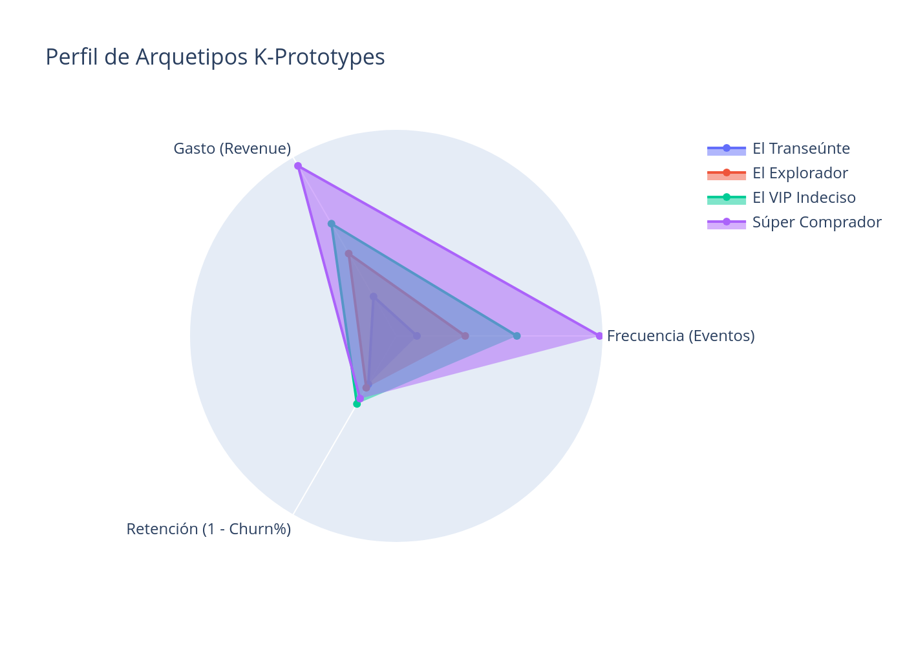
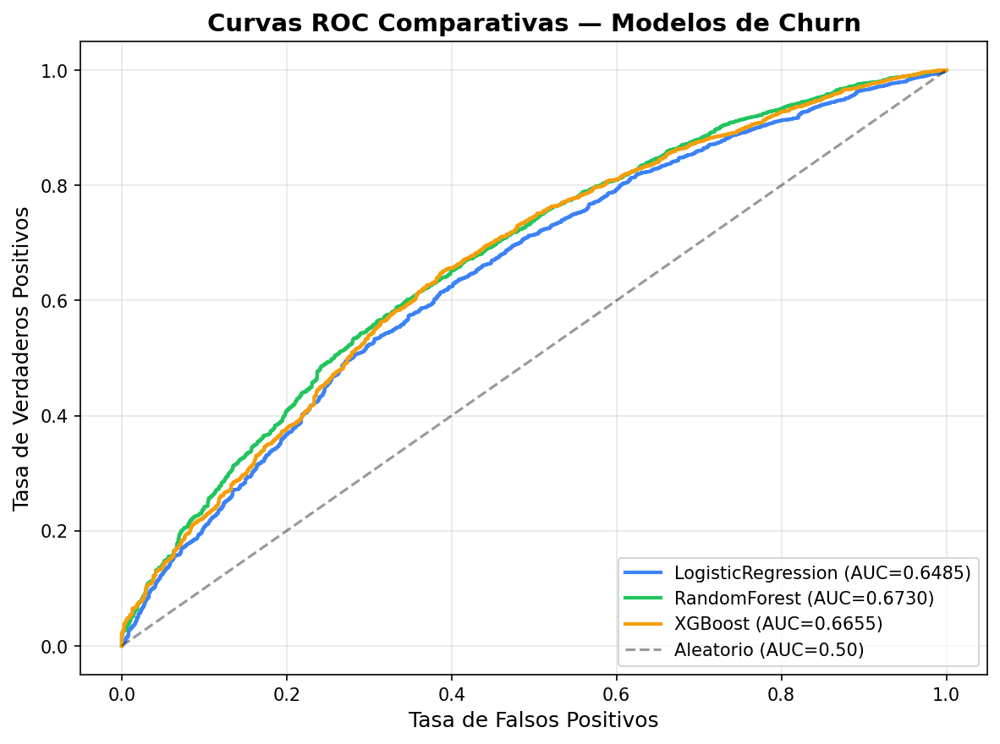
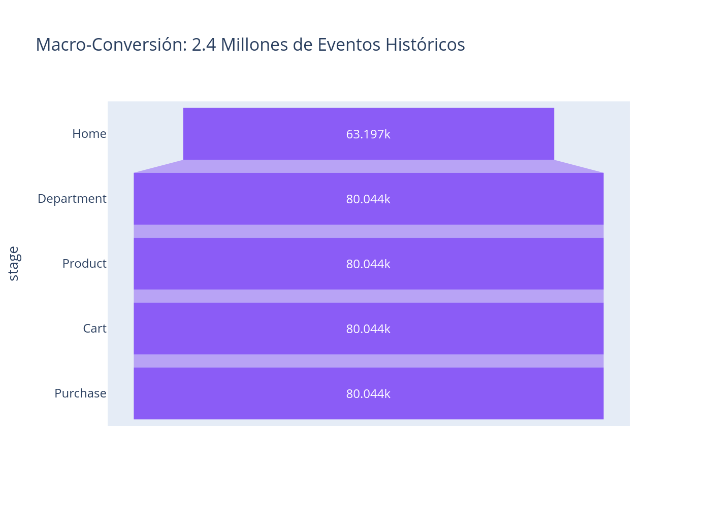
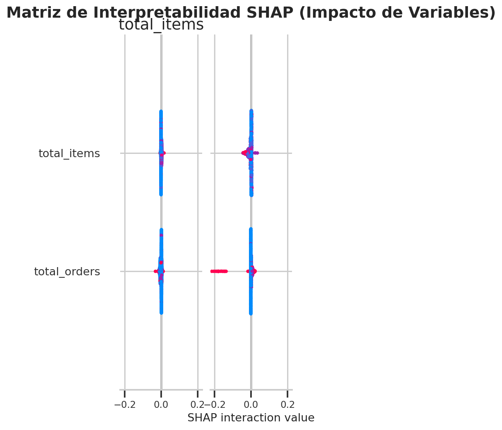
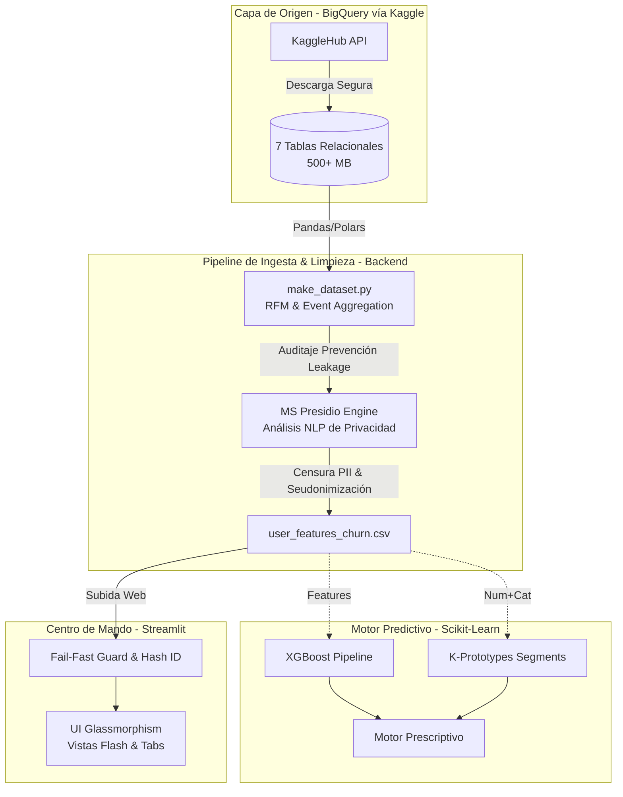

---

## 🏆 Insignias


## 📌 Índice
- [Descripción del Negocio](#-descripción)
- [Documentación Técnica Detallada](#-documentación-técnica-detallada)
- [Roles del Proyecto](#-roles-del-proyecto)
- [Funciones y Aplicaciones](#-funciones-y-aplicaciones)
- [Arquitectura de la Solución](#️-arquitectura-de-la-solución)
- [Estructura del Proyecto](#-estructura-del-proyecto)
- [Privacidad Zero Trust (Shift-Left)](#-privacidad-zero-trust-shift-left)
- [Instalación y Contribución](#-instalación-y-contribución)

---

## 📙 Descripción
**TheLook E-Commerce Intelligence** es una plataforma integral de retención de clientes diseñada para procesar la gigantesca huella digital de una empresa de retail digital. Actúa como el *Centro de Mando de Retención*, cruzando más de **2.4 Millones de eventos web** y 7 tablas relacionales para identificar de forma proactiva patrones de abandono (Churn).

El sistema combina el poder del **Ecosistema Scikit-Learn/XGBoost** para realizar predicciones precisas de fuga con la estética analítica (*Glassmorphism*) de **Streamlit**, infiriendo ingresos en riesgo y accionando tácticas prescriptivas de forma automática.

> 📊 **Objetivo de Negocio**: Identificar señales tempranas de fuga para salvar "Ingresos en Riesgo" ejecutando planes de marketing dirigidos.

---

## 📚 Documentación Técnica Detallada
Para una comprensión profunda de las decisiones arquitectónicas, validaciones estadísticas y la mitigación de los riesgos en el entrenamiento (como el uso de *Polars* y la prevención del *Data Leakage*), consulta el manifiesto del proyecto:

- [**📔 Informe Ejecutivo de Hallazgos**](./reports/informe_ejecutivo.md)
- [🚀 Roadmap de Hitos Consolidados](./avance.md)
- [🔮 Planificación Futura](./avance_futuro.md)

---

## 💻 Interfaz de la Plataforma
| Prescripción de Acciones | Benchmark de Modelos y Explicabilidad (SHAP) |
|:---:|:---:|
|  |  |
| **Generación de Embudos (2.4M Eventos)** | **Perfilado de Segmentos (K-Prototypes)** |
|  |  |

---

## 👥 Roles del Proyecto
El desarrollo se estructuró dividiendo responsabilidades bajo el estándar de Topología de Agentes:
- **ML Engineer (Core & Backend)**: Garantiza la integridad temporal evitando el ruido (Data Leakage) con técnicas *cut-off date*. Diseñó el pipeline Scikit-Learn end-to-end integrando interpolaciones de hiperparámetros (Random Forest, XGBoost) y *K-Prototypes* para tratar atributos híbridos.
- **Implementador (Arquitectura & UI)**: Asegura que el código sea declarativo y optimizado. Rediseño agresivamente la interfaz implementando *Glassmorphism* CSS en Streamlit y construyó toda la estructura de interacciones dinámicas.

---

## 🎥 Funciones y Aplicaciones
- **Predicción Categórica**: Intersección entre riesgo estadístico (Alto/Medio/Bajo) medido por XGBoost y valor financiero individual del usuario.
- **Gestión CRM Dinámica (Motor Prescriptivo)**: Matriz que cruza el Nivel de Riesgo y el Arquetipo Conductual (`K-Clusters`) para sugerir canales de retención tangibles y exportables en un JSON directo para Hubspot o Mail Marketing.
- **Extracción Analítica de SCM**: Mapeos estadísticos sobre devoluciones logísticas que demostraron cómo el producto físico y la experiencia física penalizan el Customer Lifetime Value.
- **Explicabilidad (XAI)**: Mapeo de contribuciones con `SHAP TreeExplainer` para asegurar un modelo *honesto* ("caja de cristal").

---

El flujo de información desde la ingesta de transacciones puras hasta el servicio web predictivo sigue una estricta doctrina de seguridad:

### ⚙️ Arquitectura de la Solución


---

## 📁 Estructura del Proyecto
El repositorio está diseñado bajo el principio de **Mantenibilidad y Modularidad**.

```text
proyecto-ecommerce-churn/
├── data/
│   ├── raw/                    # Carga inicial descargada por kagglehub 
│   └── processed/              # Datasets limpios auditados (Zero-Trust)
│
├── src/                        # 🧱 Core Técnico (Código de Producción)
│   ├── data/                   
│   │   ├── download_datasets.py # API Fetch 
│   │   └── make_dataset.py      # ETL y DevPrivOps (Pivot Shift-Left)
│   │
│   ├── features/               # ⚡ Ingeniería de Datos
│   │   ├── anonymizer.py        # Módulo NLP Inteligente con MS Presidio
│   │   ├── build_features.py    # Transformaciones Row-wise
│   │   ├── build_funnel.py      # Agregación web-events masiva (2.4M)
│   │   ├── prescriptive_engine.py# Árbol de decisiones para acciones
│   │   └── product_analysis.py  # Fricciones exógenas (Gestión SCM)
│   │
│   ├── models/                 # 🧠 Cerebro Predictivo
│   │   ├── train_clustering.py  # Configuración K-Prototypes
│   │   └── train_model.py       # Tuning Scikit-Learn y Exportación Joblib
│   │
│   └── app/                    
│       └── main.py              # Front-Door (UI Streamlit)
│
├── models/                     # Modelos serializados .joblib
├── reports/                    # 📊 Informes offline para consumo ejecutivo
├── notebooks/                  # Bloc de notas para EDA exploratorio
├── .env.example                # Plantilla de variables (Ej: USER_SALT)
├── requirements.txt            # Dependencias
└── avance.md                   # Bitácora cronológica de los Hitos del proyecto
```

---

## 🛡️ Privacidad Zero Trust (Shift-Left)
El Dashboard prohíbe la subida de datos que contengan PII (Nombres, Emails, IPs). TheLook E-Commerce Analytics implementa **Doctrina Shift-Left Privacy**: el grueso sintáctico lo detecta `PIIAnonymizer` procesando miles de atributos natural language en el originador ETL, liberando el Dashboard de colapsos cognitivos. Cualquier salto de regla provocará que el centinela en Streamlit lance el protocolo **Fail-Fast** denegando la inferencia.

---

## 🚀 Instalación y Contribución

### 1. Requisitos Previos
- Python 3.10 o superior (Ver [Descarga oficial](https://www.python.org/downloads/)).
- **Recomendación**: Trabajar sobre SO Linux/WSL para evitar cuellos en la gestión de librerías nativas de MS Presidio.

### 2. Clonar y Preparar el Entorno
```bash
git clone https://github.com/No-Country-simulation/S03-26-Equipo-45-Data-Science.git
cd S03-26-Equipo-45-Data-Science

# Crear y activar la jaula virtual
python -m venv .venv
source .venv/bin/activate

# Instalar Core
pip install -r requirements.txt
```

### 3. Configuración del Módulo
La seguridad es lo primero. Crea la variable `USER_SALT` para la seudonimización SHA-256.
```bash
cp .env.example .env
```

### 4. Flujo Obligatorio (De 0 a 100)
1. **Descargar Origen**: `python src/data/download_datasets.py`
2. **Despliegue del Almacén Auditado**: Ejecuta el ETL pesado con IA proactiva (Shift-Left Privacidad).
   ```bash
   python src/data/make_dataset.py
   ```
3. **Entrenamiento (Opcional)**: `python src/models/train_model.py`
4. **Abrir el Dashboard**:
   ```bash
   streamlit run src/app/main.py
   ```

---
© 2026 TheLook Analytics Team | No Country Simulation
