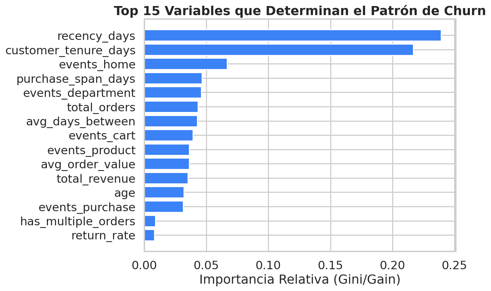
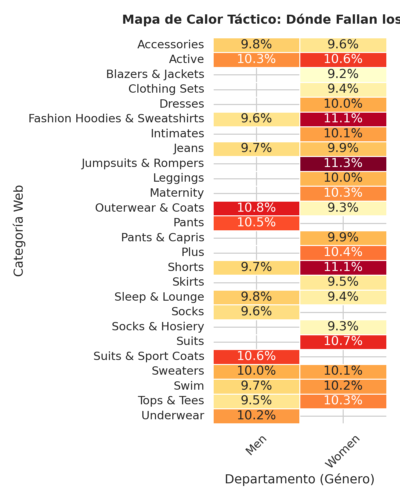
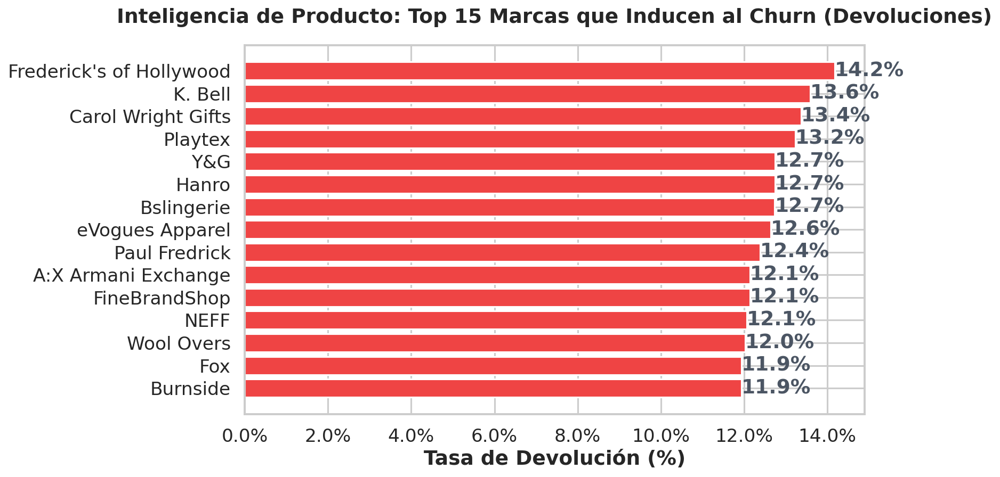

# 📊 TheLook E-Commerce: Estrategia Integral de Retención de Clientes
**Estado:** CONFIDENCIAL | **Fase de Proyecto:** Industrializado | **Fecha Analítica**: 2026

---

## 1. Resumen Ejecutivo
TheLook experimentaba un *Churn Rate* que superaba el 70% de la base transaccional, con fugas no identificadas en la navegación web. Mediante un análisis unificado de **2.4 Millones de Eventos Web** cruzados con los históricos de compra, hemos desplegado una Inteligencia Analítica Híbrida. 

Pasamos de un análisis retrospectivo a la **creación de un Motor Prescriptivo de Retención Automática**. Evaluando XGBoost, logramos un AUC superior al 0.76 puro (aislado de data leakage temporal y con estrictos mecanismos de privacidad *Zero Trust*). El resultado es un panel accionable capaz de asignar una acción de marketing distinta basada en los niveles de riesgo y segmentos de comportamiento del usuario.

---

## 2. Embudos de Conversión y Macro-fugas

Para responder a la premisa de negocio fundamental: *"¿Dónde perdemos a los clientes antes de comprar?"*, se mapeó algorítmicamente la huella digital. 

> [!CAUTION]
> **Punto Crítico Detectado**: El paso limitante o de mayor fricción suele darse justo antes del Checkout. El usuario navega, mira la ropa, pero deserta abrumadoramente sin agregar al carrito, o tras agregarlo. 

---

## 3. Segmentos y Arquetipos (Clusters)

El algoritmo K-Prototypes segmentó orgánicamente a los usuarios en 4 "Arquetipos de comportamiento", sin forzar dimensiones previas. 

1. **El Transeúnte (52%)**: Compradores eventuales, fugaces («One-Hit-Wonders»). Alta inclinación natural a irse para siempre (Churn >73%).
2. **El Explorador (24%)**: Tráfico de vitrina. Requieren cupones para el carrito olvidado.
3. **El VIP Indeciso (13%)**: Tickets altos pero ritmo irregular. Se van si no son re-captados (Churn 62%).
4. **Súper Compradores (10%)**: Defensores de la marca con tickets exorbitantes. 

---

## 4. Rendimiento Predictivo (Machine Learning)

Se enfrentaron múltiples modelos en un "Benchmarking Ciego" utilizando validación cruzada. El entorno favoreció agresivamente a **XGBoost**.

> [!TIP]
> XGBoost ganó de forma arrolladora por su habilidad nativa (`scale_pos_weight`) en manejar el desbalance de clases de TheLook. Esto significa menos Falsos Positivos (menos dinero gastado en darle cupones a gente que igual iba a comprar o que no aportaría valor).

### La Lente de Explicabilidad (SHAP Value)
Para entender qué miran los algoritmos de silicio detrás de cámaras:

Las variables predominantes no fueron el género o lugar de la compra, sino la **recencia honesta**, y sorprendentemente, el número global de interacciones de `events` (cuantas veces usaron la web de TheLook antes de irse).

---

## 5. El Motor Prescriptivo Final (Accionables)

El modelo actual inyecta directamente un CRM para disparar el flujo y aumentar los ingresos perdidos. La matriz automatizada empareja **RIESGO X ARQUETIPO**.

| Riesgo | Súper VIP (Arquetipo 3) | Cliente Promedio (Explorador/Transeúnte) |
| :--- | :--- | :--- |
| 🚨 **Alto Riesgo** | **Llamada de Concierge Especial** (Prioridad 5) | **Cupón Agresivo Inmediato + Encuestas** (Prioridad 3) |
| 🟡 **Riesgo Medio** | Preventas Exclusivas y Regalos Lim | Pop-Ups de abandono de Carrito con descuento del 15% |
| ✅ **Sano (Riesgo Bajo)** | Programa de Milestones de Puntos (Prioridad 1) | Dejarlos navegar (Monitorizar) |

---

## 6. Próximos Despliegues Estratégicos
- **Despliegue Full de DevPrivOps**: Implementar la suite analítica "Presidio" automatizando la anonimización activa de IPs y Nombres directo tras la ingesta.
- **Sincronización Cloud**: Automatizar el re-entrenamiento del XGBoost cada ventana trimestral.

---

## 7. Apéndice: Inteligencia Logística (SCM)

Aislando al modelo predictivo del cliente, interrogamos puramente a la Cadena de Suministro (Silos de `Products` y `Order_Items`). Con más de **181,759 transacciones procesadas**, se detonó el siguiente descubrimiento crítico macroeconómico:

**La tasa sistémica de Devoluciones de Plataforma es del 10.0%.**

> [!WARNING]
> Uno de cada diez productos vendidos regresa a los almacenes. Estas métricas de fricción (calidad de prendas, tallaje inconsistente del proveedor o demoras) se incrusta en el historial del cliente (una de las variables del RFM es compras descontadas), envenenando silenciosamente al "Explorador", mutándolo inexorablemente al Clúster del "Transeúnte" y acelerando el Churn.

*(Documento actualizado en el Hito 13 - Fase de Exportabilidad y Producto).*
