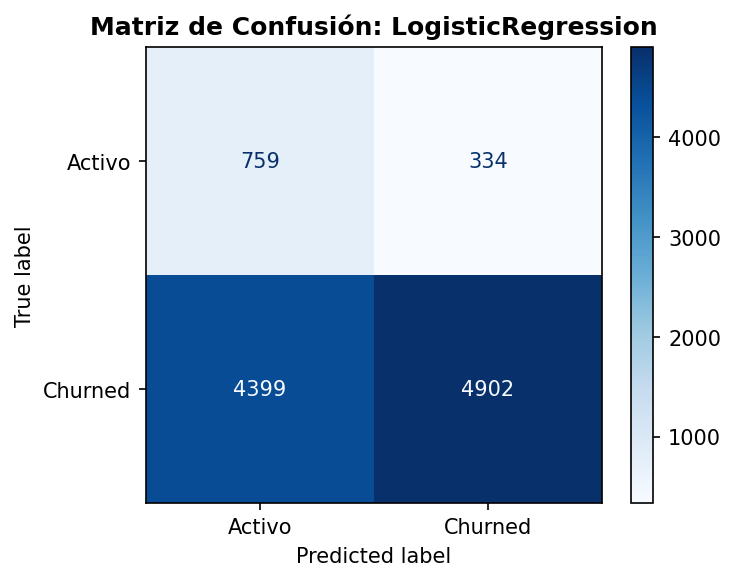
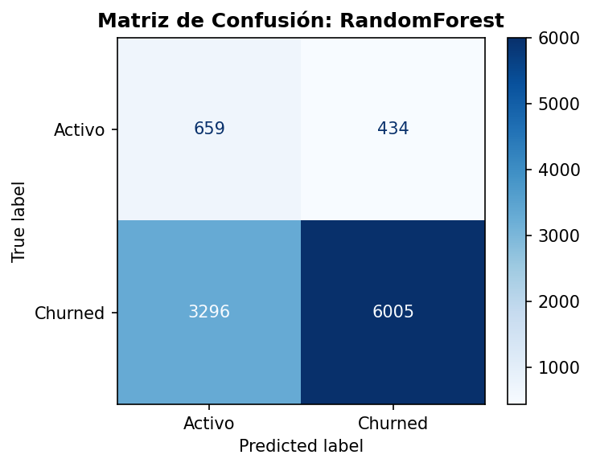
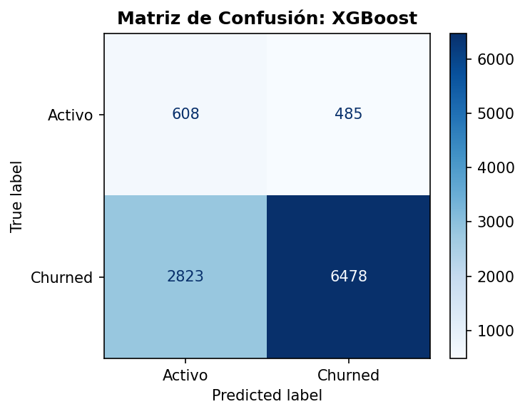

# 📊 Benchmark de Modelos de Churn

## Tabla Comparativa

| Modelo | Accuracy | Precision | Recall | F1-Score | AUC | Brier |
| :--- | :--- | :--- | :--- | :--- | :--- | :--- |
| LogisticRegression | 0.5446 | 0.9362 | 0.5270 | 0.6744 | 0.6485 | 0.2364 |
| RandomForest | 0.6411 | 0.9326 | 0.6456 | 0.7630 | 0.6730 | 0.2158 |
| XGBoost | 0.6817 | 0.9303 | 0.6965 | 0.7966 | 0.6655 | 0.2063 |

🏆 **Modelo Ganador**: XGBoost (Optimizado por **Recall** = 0.6965)

## Curvas ROC Comparativas

## Matrices de Confusión

### LogisticRegression

### RandomForest

### XGBoost

## Interpretación

- **AUC (Área Bajo la Curva ROC)**: Mide la capacidad de discriminar entre Churned y Activo. Mayor es mejor.
- **Brier Score**: Mide la calibración de probabilidades. Menor es mejor.
- **Recall**: Proporción de churners reales detectados. Crítico para campañas de retención.
- **XGBoost** usa `scale_pos_weight` para manejar el desbalance de clases de forma nativa.
